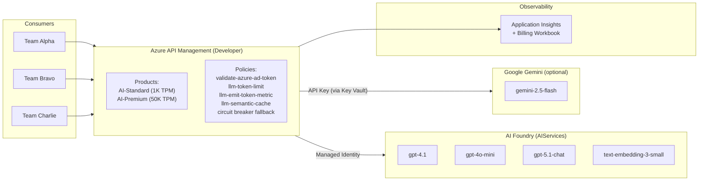
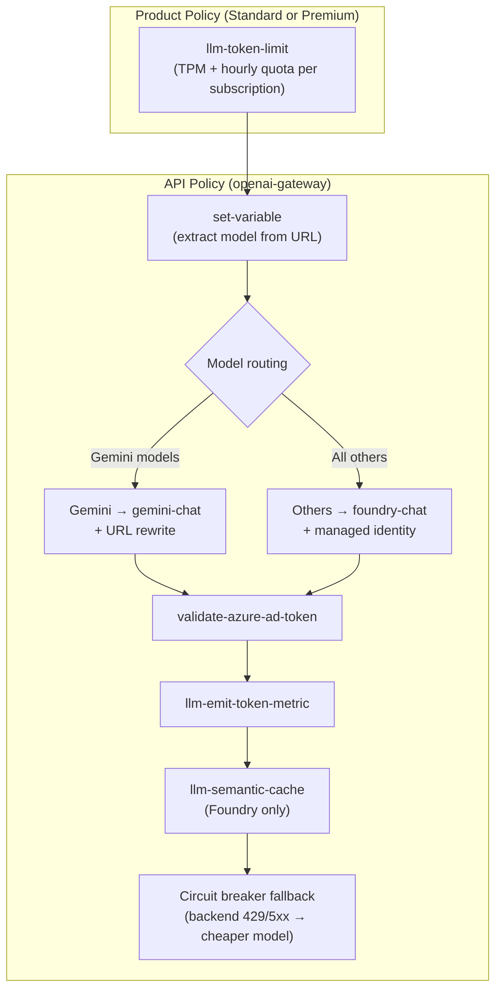
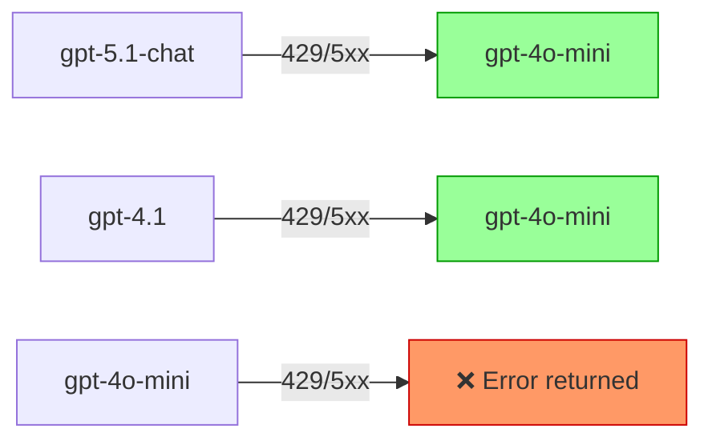

# AI Gateway Billing Sample

Azure API Management as an **AI Gateway** in front of Microsoft AI Foundry and
(optionally) Google Gemini, with per-consumer **billing/chargeback metering**,
**semantic caching**, and **token rate limiting**.

## Architecture



### Key Features

| Feature | How It Works |
|---------|-------------|
| **Token metering** | `llm-emit-token-metric` emits per-request token counts to App Insights with dimensions: Subscription ID, User ID, API ID, Operation ID, Client IP, Model, Served-Model |
| **Per-consumer billing** | KQL queries + Azure Monitor Workbook aggregate metrics by subscription (consumer) for chargeback with per-model cost estimation |
| **Token rate limiting** | `llm-token-limit` enforces TPM and hourly quotas per APIM product (Standard vs Premium) |
| **Circuit breaker + fallback** | Native APIM circuit breaker on backends with model-tier fallback: premium models (gpt-5.1-chat, gpt-4.1) automatically degrade to gpt-4o-mini on 429/5xx errors |
| **Semantic caching** | `llm-semantic-cache-lookup/store` deduplicates similar prompts using an embeddings backend (bypassed on fallback to prevent cross-model contamination) |
| **Model routing** | Requests are routed to AI Foundry or Google Gemini based on the model name in the URL path. Gemini models use the Google AI OpenAI-compatible endpoint; all others use AI Foundry with managed identity auth |
| **JWT authentication** | `validate-azure-ad-token` validates Entra ID tokens — each consumer has a service principal |

## Prerequisites

- [Terraform](https://developer.hashicorp.com/terraform/install) >= 1.9
- [Azure CLI](https://learn.microsoft.com/cli/azure/install-azure-cli) — logged in (`az login`)
- An Azure subscription with permissions to create:
  - Resource groups, Cognitive Services (AI Foundry), API Management, Key Vault
  - Entra ID app registrations (requires Application Administrator or equivalent)
- [uv](https://docs.astral.sh/uv/getting-started/installation/) — Python package runner
- [REST Client](https://marketplace.visualstudio.com/items?itemName=humao.rest-client) VS Code extension (optional, for `.http` tests)
- *(Gemini only)* [Google Cloud CLI](https://cloud.google.com/sdk/docs/install) — logged in (`gcloud auth application-default login`)

## Quick Start

### 1. Clone and configure

```bash
cd solutions/ai-gateway-billing-sample/infra
cp terraform.tfvars.example terraform.tfvars
# Edit terraform.tfvars — set subscription_id and apim_publisher_email at minimum
```

### 2. Deploy

```bash
terraform init
terraform plan -out=tfplan
terraform apply tfplan
```

> **Note**: The APIM Developer SKU takes **30–45 minutes** to provision. The AI
> Foundry and other resources deploy much faster.

### 3. Get outputs

```bash
# Non-sensitive outputs
terraform output

# Sensitive values — outputs in .env format for tests/
terraform output -json | jq -r '
  "APIM_GATEWAY_URL=" + .apim_gateway_url.value,
  "TENANT_ID=" + .tenant_id.value,
  "API_AUDIENCE=" + .api_audience.value,
  "ALPHA_SUBSCRIPTION_KEY=" + .subscription_key_alpha_standard.value,
  "ALPHA_CLIENT_ID=" + .team_alpha_client_id.value,
  "ALPHA_CLIENT_SECRET=" + .team_alpha_client_secret.value,
  "BRAVO_SUBSCRIPTION_KEY=" + .subscription_key_bravo_premium.value,
  "BRAVO_CLIENT_ID=" + .team_bravo_client_id.value,
  "BRAVO_CLIENT_SECRET=" + .team_bravo_client_secret.value,
  "CHARLIE_SUBSCRIPTION_KEY=" + .subscription_key_charlie_standard.value,
  "CHARLIE_CLIENT_ID=" + .team_charlie_client_id.value,
  "CHARLIE_CLIENT_SECRET=" + .team_charlie_client_secret.value
'
```

### 4. Test

See the full **[Testing Guide](docs/testing.md)** for detailed instructions,
all scenarios, and troubleshooting.

#### Quick smoke test (.http)

Create a `.env` file in the `tests/` directory:

```bash
APIM_GATEWAY_URL=https://apim-<name>.azure-api.net
ALPHA_SUBSCRIPTION_KEY=<key>
BRAVO_SUBSCRIPTION_KEY=<key>
```

Open `tests/quick-test.http` in VS Code and click "Send Request" on each block.

#### Load test (Python)

```bash
cd tests
uv sync
uv run load-test.py
```

The load test reads credentials from the same `.env` file used by the smoke
tests. You can override values with CLI flags:

```bash
uv run load-test.py --requests 20 --concurrency 5
```

### 5. View billing dashboard

1. Open the Azure portal → your **Resource Group**
2. Find the **AI Gateway Billing Dashboard** workbook (deployed automatically)
3. Or navigate to Application Insights → **Workbooks** to find it there
4. For ad-hoc queries, run `workbook/sample-queries.kql` directly in Log Analytics

## What Gets Deployed

| Resource | Purpose |
|----------|---------|
| Resource Group | Container for all resources |
| Log Analytics Workspace | Backend for Application Insights |
| Application Insights | Receives token metrics from APIM (custom metrics with dimensions enabled) |
| AI Foundry (AIServices) | Hosts AI models (chat + embeddings) |
| AI Foundry Project | Organizational container |
| API Management (Developer) | AI Gateway with policies, backends, products, and subscriptions |
| APIM Logger + Diagnostics | API-level App Insights diagnostic with custom metrics enabled |
| APIM Platform Diagnostic Setting | Sends GatewayLogs, audit logs, and platform metrics to Log Analytics |
| Entra ID App Registrations (×4) | API audience + 3 consumer service principals with passwords |
| RBAC Role Assignments | APIM managed identity → Foundry (chat + embeddings); APIM → Key Vault |
| Key Vault | Stores Gemini API key (Key Vault-backed APIM named value); optionally stores consumer test credentials |
| Azure Monitor Workbook | Billing dashboard with per-model cost estimation (auto-deployed) |
| *(Gemini only)* Google AI API Key | API key for Gemini, stored in Key Vault |
| *(Gemini only)* APIM Gemini Backend | Routes Gemini model requests to Google AI's OpenAI-compatible endpoint |

## APIM Policy Stack

Policies are applied in this order (product → API → global):



### Circuit Breaker & Model-Tier Fallback

When a Foundry model returns **429** (rate limited) or **5xx** (server error),
the gateway automatically retries with a cheaper model:



> **Important**: Fallback only triggers on **backend-originated** 429s (model
> deployment overloaded). APIM's own `llm-token-limit` 429s (consumer over
> quota) are returned as-is — consumers cannot bypass their rate limits by
> triggering a fallback.

**Observability**: Fallback responses include headers:
- `x-served-model` — the model that actually generated the response
- `x-fallback-reason` — why fallback occurred (e.g., `rate-limited`, `server-error`)

**Native circuit breaker**: The Foundry backend has an APIM-level circuit breaker
that trips after repeated failures. Once open, requests fail fast (503) rather
than queuing against a degraded backend.

> **Production note**: This sample uses model-tier fallback as a single-region
> resilience pattern. In production, prefer **multi-region failover** (same model
> across 2+ regions with priority-based backend pools) or **PTU → PayGo
> spillover** (provisioned throughput for baseline + pay-as-you-go for bursts).
> See [Architecture Decisions](docs/architecture.md#decision-15-circuit-breaker-with-model-tier-fallback)
> for a detailed comparison.

## Cost Estimate

| Resource | Approximate Monthly Cost |
|----------|-------------------------|
| APIM Developer | ~$50 |
| AI Foundry (S0) | Pay-per-token (varies with usage) |
| Log Analytics | ~$2–5 (30-day retention, minimal data) |
| Application Insights | Included with Log Analytics |
| Entra ID | Free tier |
| **Total (idle)** | **~$55/month** |

## Cleanup

```bash
cd infra
terraform destroy
```

> This removes all Azure resources **and** the Entra ID app registrations.

## Project Structure

```
ai-gateway-billing-sample/
├── README.md                        # This file
├── infra/
│   ├── main.tf                      # All resources (Azure + conditional GCP)
│   ├── variables.tf                 # Input variables with validation
│   ├── outputs.tf                   # Endpoints, keys, credentials
│   ├── providers.tf                 # azurerm, azapi, azuread, google providers
│   ├── terraform.tfvars.example     # Example variable values
│   └── policies/
│       ├── api-openai.xml           # API-level: routing, JWT, metrics, cache
│       ├── product-standard.xml     # Standard tier token limits
│       └── product-premium.xml      # Premium tier token limits
├── workbook/
│   ├── ai-gateway-billing.json      # Azure Monitor Workbook template
│   └── sample-queries.kql           # Standalone KQL queries
├── tests/
│   ├── quick-test.http              # REST Client smoke tests (incl. Gemini)
│   ├── load-test.py                 # Python multi-consumer load simulator
│   ├── pyproject.toml               # Python dependencies (uv sync)
│   └── requirements.txt             # Python dependencies (pip fallback)
└── docs/
    ├── architecture.md              # Design decisions
    └── testing.md                   # Testing guide and troubleshooting
```

## Further Reading

- [Azure APIM as AI Gateway](https://learn.microsoft.com/azure/api-management/genai-gateway-capabilities)
- [llm-emit-token-metric policy](https://learn.microsoft.com/azure/api-management/llm-emit-token-metric-policy)
- [llm-token-limit policy](https://learn.microsoft.com/azure/api-management/llm-token-limit-policy)
- [llm-semantic-cache-lookup policy](https://learn.microsoft.com/azure/api-management/llm-semantic-cache-lookup-policy)
- [Microsoft AI Foundry](https://learn.microsoft.com/azure/ai-services/what-are-ai-services)
